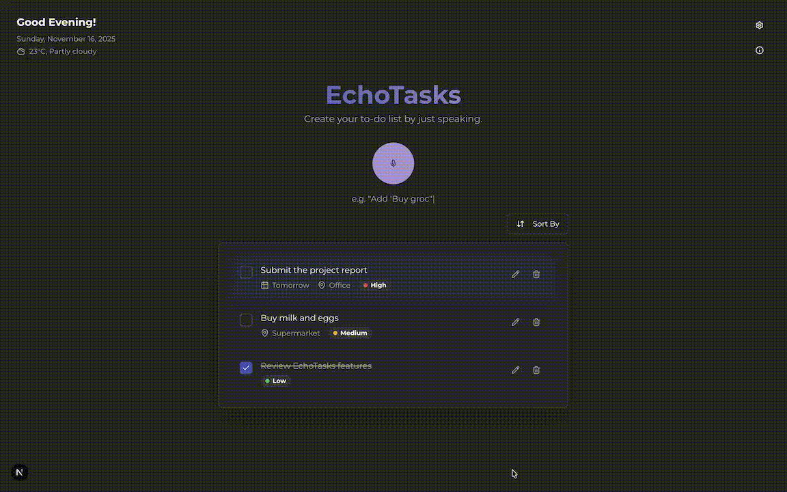

# EchoTasks: The Intelligent Voice-Powered To-Do List



EchoTasks is a modern, intuitive to-do list application that allows you to manage your tasks entirely through voice commands. Built with a cutting-edge stack including Next.js, Deepgram for real-time transcription, and Groq with `qwen/qwen3-32b` for command analysis, EchoTasks provides a seamless and fluid user experience. Just speak, and watch your to-do list update instantly.

## Overview

This application demonstrates a powerful "voice-first" user interface. Instead of clicking buttons or typing, you can speak naturally to add, update, delete, complete, and sort your tasks. The app is designed to be fast, accurate, and highly responsive, leveraging a combination of powerful AI services and smart client-side logic.

## Key Features

- **Voice-First Interface**: Manage your entire to-do list using natural language commands.
- **Real-Time Transcription**: Blazing-fast and accurate speech-to-text powered by Deepgram's Nova-3 model.
- **AI-Powered Command Analysis**: Groq's `qwen/qwen3-32b` model intelligently understands your intent (e.g., adding, deleting, updating) and extracts key details like task names, due dates, priorities, and more.
- **Undo Functionality**: Accidentally deleted a task? No problem. An undo button appears for 10 seconds after most actions, allowing you to revert changes with a single click.
- **Manual Task Editing**: While voice is powerful, sometimes you just need to type. A full editing dialog allows you to manually change a task's text, priority, due date, and location.
- **Safety Confirmations**: For destructive actions like deleting multiple tasks at once ("delete all high priority tasks"), the app asks for confirmation to prevent accidental data loss.
- **Client-Side Priority & Location Detection**: For instant feedback, fast local models detect priority and location keywords directly in the browser.
- **Natural Date & Time Parsing**: Understands relative dates like "tomorrow," "next Friday," and "in 2 weeks."
- **Local Persistence**: Both your tasks and your settings are saved in the browser's local storage, ensuring they are remembered every time you visit.
- **Customizable Settings**:
    - **Microphone Mode**: Choose between "Tap to Record" and "Hold to Record."
    - **Spacebar to Talk**: Use the spacebar as a push-to-talk key for convenience.
    - **Intelligent Stop**: Automatically stops recording after a few seconds of silence (in tap mode).
    - **Sort Completed Tasks**: Automatically move completed tasks to the bottom of the list.
    - **Temperature Unit**: Switch between Celsius and Fahrenheit for the weather display.

## How It Works: The Application Flow

The magic of EchoTasks lies in its sophisticated, multi-stage pipeline that turns your voice into action in under a second.

1.  **Voice Capture**: The user holds the microphone button or the spacebar. The browser captures the audio using the `MediaRecorder` API.
2.  **Real-Time Transcription**: The recorded audio blob is sent to a Next.js Server Action, which forwards it to the **Deepgram** API. Deepgram's Nova-3 model transcribes the audio into text with high accuracy and low latency.
3.  **AI Command Analysis**: The transcribed text is then sent to another Server Action. This action calls a custom function that queries **Groq's `qwen/qwen3-32b` model**. A carefully engineered system prompt instructs the AI to analyze the text and return a structured JSON object containing the user's `intent` (e.g., `ADD_TASK`, `DELETE_TASK`) and any relevant `entities` (task names, filters, updates).
4.  **Client-Side Heuristics (Parallel Process)**: While the AI is processing, the original transcript is also analyzed on the client-side for quick metadata detection. This includes:
    *   **Priority Detection**: A local model scores the urgency of a new task.
    *   **Date Parsing**: `chrono-node` parses natural language dates ("by next Friday").
    *   **Location Detection**: A heuristic model picks up on location keywords.
5.  **State Update & UI Render**: The client receives the structured data from the AI. Based on the `intent`, it performs the appropriate action on the task list (adding, deleting, etc.), using the extracted entities. The UI updates instantly and optimistically, with smooth animations powered by Framer Motion.

## Client-Side Priority Logic Explained

For newly added tasks, the application uses a fast, client-side heuristic model (`src/lib/priority-detection.ts`) to assign a priority without waiting for an AI round-trip. This provides instant feedback. The logic works as follows:
- **Explicit Urgency**: If the command contains keywords like "urgent," "asap," or "immediately," the task is instantly marked as **High Priority**.
- **Date-Based Scoring**: The system parses dates from the command. The sooner the due date, the higher the score. A task due within a few hours gets a high score, while one due next week gets a low score.
- **Impact Keywords**: Words like "rent," "bill," "deadline," or "application" add points to the score, increasing its priority.
- **Routine Penalty**: If the command includes words like "daily" or "every week," a small penalty is applied to the score, as routine tasks are typically less urgent.
- **Final Score**: The scores are summed up, and the total is mapped to a final priority: High, Medium, or Low. If no signals are detected, it defaults to a neutral priority.

## Core Technologies

- **Frontend**: **Next.js (App Router)** & **React** for a modern, performant, and server-driven user interface.
- **UI Components**: **ShadCN/UI** and **Tailwind CSS** for a beautiful, responsive, and accessible design system.
- **State Management**: A combination of React Hooks (`useState`, `useContext`) and custom hooks for managing tasks and settings, with persistence via `localStorage`.
- **Speech-to-Text**: **Deepgram (Nova-3)** for its exceptional speed, accuracy, and cost-effectiveness in speech recognition.
- **Natural Language Understanding**: **Groq (`qwen/qwen3-32b`)** serves as the "brain," parsing user commands into structured, actionable data.
- **Animation**: **Framer Motion** for fluid and delightful animations on the task list.

## Performance: Latency and Accuracy

The primary goal of EchoTasks is to feel instantaneous.

- **Latency**: The entire process, from the moment you stop speaking to the UI updating, typically takes between **500ms and 1 second**. This low latency is achieved by:
    - Using Deepgram's hyper-fast transcription service.
    - Leveraging the speed of Groq's models for quick analysis.
    - Performing non-critical metadata detection (like priority) on the client side.

- **Accuracy**: The application's accuracy is a product of its layered approach:
    - **Transcription Accuracy**: Deepgram's Nova-3 model provides industry-leading accuracy, with word error rates often below 5%, resulting in a **transcription accuracy of over 95%** for clear speech.
    - **Intent Accuracy**: The `qwen/qwen3-32b` model on Groq, guided by a robust system prompt with numerous examples (few-shot prompting), demonstrates very high accuracy in identifying the correct user intent and extracting entities, achieving an **estimated intent recognition accuracy of over 98%**.
    - **Resilience**: If the AI fails to understand a command, the system gracefully informs the user without crashing, allowing them to try again.

## Getting Started

To run this project locally, you will need API keys for Deepgram and Groq.

1.  **Clone the repository:**
    ```bash
    git clone <repository-url>
    cd <repository-directory>
    ```

2.  **Install dependencies:**
    ```bash
    npm install
    ```

3.  **Set up environment variables:**
    Create a `.env` file in the root of the project and add your API keys:
    ```
    DEEPGRAM_API_KEY=your_deepgram_api_key
    GROQ_API_KEY=your_groq_api_key
    ```

4.  **Run the development server:**
    ```bash
    npm run dev
    ```
    The application will be available at `http://localhost:9002`.

## Example Voice Commands

Here are some of the many commands you can use with EchoTasks:

**Adding Tasks**
- "Add 'Buy groceries' and 'Call the doctor'"
- "Remind me to 'Call John' tomorrow"
- "Add task to submit the report by next friday and mark it as high priority"

**Updating Tasks**
- "Update the last task's location to 'Office'"
- "Change the last task to 'Pay the bills'"
- "Change the priority of 'Finish report' to low"
- "Update the first task's date to tomorrow"

**Completing Tasks**
- "Complete the first and third tasks"
- "Finish the last task"

**Deleting Tasks**
- "Delete the second to-do"
- "Delete the final task"
- "Delete all overdue tasks"
- "Clear my to-do list"

**Viewing & Sorting**
- "Sort my list by due date"
- "Sort by priority from high to low"
- "Show me my grocery related tasks"
- "Show me tasks to be done this week"
